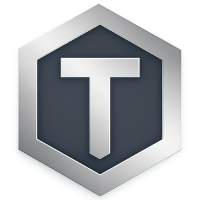
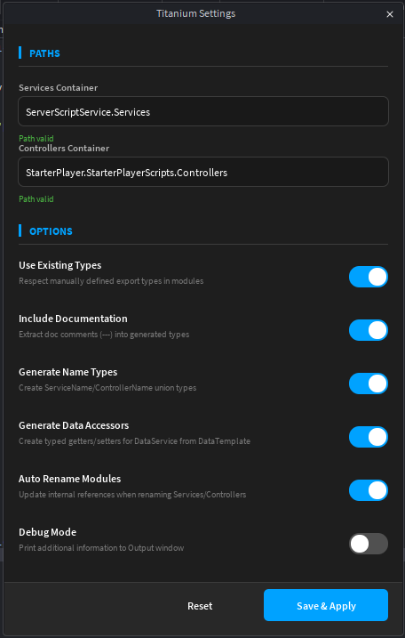

# ⚡ Titanium Framework

**Production-ready Roblox framework with built-in data architecture, client replication, and monetization systems.**



---

## About

Titanium is a batteries-included production framework that handles data persistence, client replication, and monetization so you can focus on building gameplay. Stop wiring up ProfileStore for the 10th time. Stop rebuilding monetization systems from scratch. Titanium eliminates repetitive infrastructure work and provides enterprise-grade systems out of the box.

---

## Why Choose Titanium?

### Zero Boilerplate

Define your DataTemplate once and Titanium auto-generates type-safe getters, setters, and client replication. No more manually configuring ProfileStore sessions. No more creating RemoteEvents for every data change. Titanium handles the infrastructure—you build features, not plumbing.
```lua
-- Define your data structure once
local DataTemplate = {
    Coins = 0,
    Level = 1,
    Inventory = {}
}

-- Get automatic type-safe accessors everywhere
local coins = DataService:GetCoins(player)
DataService:SetCoins(player, coins + 100)  -- Auto-replicates to client
```

### Production-Ready Architecture

Built on proven libraries (ProfileStore, Replica) with proper session management, graceful shutdown handling, and automatic client synchronization. Services follow a clean Init/Start lifecycle pattern, making dependency management predictable and debugging straightforward.

**Included Built-In Services:**
- **DataService** - ProfileStore integration with automatic Replica replication
- **MonetizationService** - Gamepass/Product/Gifting systems with transaction validation
- **BetterAnalyticsService** - Roblox Analytics wrapper with event tracking
- **TestRunnerService** - Integrated Pest testing framework support

### Developer Experience

Studio plugin auto-generates ServerTypes for full intellisense across your entire codebase. Configurable service/controller paths, automatic gamepass detection in function parameters, and settings UI for customizing framework behavior. Titanium respects your workflow while eliminating repetitive tasks.



**Plugin Features:**
- ✅ Auto-generate type definitions from your services
- ✅ Configurable DataTemplate with leaderstats support
- ✅ Gamepass/Product function generation
- ✅ Path configuration for Services/Controllers
- ✅ Documentation generation toggle

---

## Installation

### Option 1: GitHub Download (Recommended)

Get the latest version here: [Titanium_Framework.rbxl](./Titanium_Framework.rbxl)
Download the plugin from the Roblox Creator Store (IMPORTANT!): [Titanium Studio](https://create.roblox.com/store/asset/129879750902925/Titanium-Studio)

### Option 2: Roblox Creator Store Download

1. Download the framework from the [Roblox Creator Store](YOUR_CREATOR_LINK_HERE)
2. Download the plugin (IMPORTANT!): [Titanium Studio](https://create.roblox.com/store/asset/129879750902925/Titanium-Studio)
3. Import into Roblox Studio
4. Read the README ModuleScript

---

## Quick Start

### 1. Configure Your Data

Edit `ServerScriptService.Server.Configuration.DataTemplate`:
```lua
return {
    -- Your player data structure
    Coins = 0,
    Gems = 0,
    Level = 1,
    Inventory = {},
    Settings = {
        MusicEnabled = true,
        SFXEnabled = true
    }
}
```
Tip: Don't forget to type your entries to get the best results when the plugin auto-generates the setters and getters!

### 2. Create a Service

`ServerScriptService.Services.ExampleService`:
```lua
--!strict
--@title: ExampleService
--@author: YourName
--@date: 01/01/25
--[[@description:
	Quick description of what the service does.

	USAGE:
		Service template to be used as a reference for making new services.

	FEATURES:
		ExampleService:Foo()
		A function that returns "Bar"
		
		Example usage:
		local result: string = ExampleService:Foo()
		print(result) -- "Bar"
]]

--[[ Roblox Services ]]
local ServerScriptService = game:GetService("ServerScriptService")

--[[ Titanium ]]
local Titanium = require(ServerScriptService.Server.TitaniumServer)

local Logger = Titanium.GetSharedUtility("Logger").new(script.Name)

--[[ Imports ]]

--[[ Types ]]

--[[ Constants ]]

--[[ Private Variables ]]

local ExampleService = {}

ExampleService.Network = {
	FooBarEvent = {
		Type = "Event", -- Can also be a "Function"
		Cooldown = 0.5,
		Handler = function(self: typeof(ExampleService), player: Player)
			ExampleService:Foo()
		end,
	},
}

--[[ Private Functions ]]

--[[ Public Functions ]]

function ExampleService:Foo(): string
	return "Bar"
end

--[[ Initialization Functions ]]

function ExampleService:Init()

end

function ExampleService:Start()
	
end

return ExampleService
```

### 3. Create a Controller

`StarterPlayer.StarterPlayerScripts.Controllers.ExampleController`:
```lua
--!strict
--@title: ExampleController
--@author: YourName
--@date: 01/01/25
--[[@description:
	Quick description of what the controller does.

	USAGE:
		Controller template to be used as a reference for making new controllers.

	FEATURES:
		ExampleController:Bar()
		A function that returns "Foo"
		
		Example usage:
		local result: string = ExampleController:Bar()
		print(result) -- "Foo"
]]

--[[ Roblox Services ]]
local StarterPlayer = game:GetService("StarterPlayer")

--[[ Titanium ]]
local Titanium = require(StarterPlayer.StarterPlayerScripts.Client.TitaniumClient)

--[[ Titanium Controllers ]]

--[[ Imports ]]

--[[ Types ]]

--[[ Constants ]]

--[[ Private Variables ]]

local ExampleController = {}

--[[ Private Functions ]]

--[[ Public Functions ]]

function ExampleController:Bar(): string
	return "Foo"
end

--[[ Initialization Functions ]]

function ExampleController:Init()

end

function ExampleController:Start()

end

return ExampleController
```

### 4. Start Titanium

Titanium auto-starts thanks to the server and client endpoints. So you don't have to deal with starting it!

If you're curious though, you can check in ServerScriptService.Server and StarterPlayer.StarterPlayerScripts.Client to see how it works.

---

## Architecture
Scheme + Image

```
ReplicatedStorage
└── Titanium/
    ├── SharedUtilities/
    └── ModuleLoader

ServerScriptService
├── Services
|   └── ExampleService
├── Tests
|   └── ExampleServiceTest
└── Server/
    ├── TitaniumServer
    │   ├── BuiltInServices/
    │   │   ├── DataService
    │   ├── MonetizationService
    │   │   ├── TestRunnerService
    │   │   └── BetterAnalyticsService
    │   ├── ServerUtilities/
    │   └── ServerTypes
    └── Configuration/
        ├── leaderstats/
        ├── DataTemplate
        ├── GamepassList
        └── ProductFunctions

StarterPlayer
└── StarterPlayerScripts/
    ├── Controllers
    |   ├── GuiControllers/
    |   └── ExampleController
    └── Client/
        └── TitaniumClient
            ├── ClientUtilities/
            ├── BuiltInControllers/
            │   ├── DataController
            │   ├── BaseGuiController
            │   └── MonetizationController
            └── ClientTypes
```


---

## Testing

Titanium integrates with [Pest for Luau](https://github.com/Wharkk/PestLuau) for comprehensive test coverage:
```lua
--!strict
--@title: ExampleServiceTest
--@author: YourName
--@date: 01/01/25
--[[@description:
	Tests ExampleService's methods and network endpoints
]]

--[[ Roblox Services ]]
local ServerScriptService = game:GetService("ServerScriptService")

--[[ Tests ]]
return function(Pest)
	local it, describe, expect = Pest.it, Pest.describe, Pest.expect
	local ExampleService = require(ServerScriptService.Services.ExampleService)

	describe("ExampleService", function()
		describe("Lifecycle", function()
			it("should initialize correctly", function()
				expect(ExampleService):toBeTable()
				expect(ExampleService.Init):toBeA("function")
			end)

			it("should start correctly", function()
				expect(ExampleService):toBeTable()
				expect(ExampleService.Start):toBeA("function")
			end)
		end)

		describe("Methods", function()
			it("returns a string from Foo()", function()
				local result = ExampleService:Foo()
				expect(result):toBe("Bar")
			end)
		end)

		describe("Network", function()
			it("should have Network table defined", function()
				expect(ExampleService.Network):toBeTable()
			end)

			it("should define FooBarEvent endpoint", function()
				expect(ExampleService.Network.FooBarEvent):toBeTable()
			end)

			it("should configure FooBarEvent as an Event type", function()
				expect(ExampleService.Network.FooBarEvent.Type):toBe("Event")
			end)

			it("should set cooldown for FooBarEvent", function()
				expect(ExampleService.Network.FooBarEvent.Cooldown):toBe(0.5)
				expect(ExampleService.Network.FooBarEvent.Cooldown):toBePositive()
			end)

			it("should have a handler function for FooBarEvent", function()
				expect(ExampleService.Network.FooBarEvent.Handler):toBeA("function")
			end)
		end)
	end)
end
```

Run tests easily just by creating new modules with the naming convention "[ServiceName]Test" under the "Tests" folder, and they will be automatically ran in test mode in studio.

---

## Documentation

For detailed documentation, examples, and best practices, see:
- [Full Documentation](docs/README.md) *(coming soon)*
- [API Reference](docs/API.md) *(coming soon)*
- [Examples](examples/) - Practical examples and patterns

---

## Contributing

Contributions are welcome! Feel free to:
- Report bugs via [Issues](https://github.com/Wharkk/TitaniumFramework/issues)
- Submit pull requests
- Suggest features or improvements

---

## License

MIT License - See [LICENSE](LICENSE) for details

---

## Credits

Built by **wharkk** ([@wharkk_](https://x.com/wharkk_))

**Portfolio**: [wharkk-developer.framer.website](https://wharkk-developer.framer.website)

**Powered by:**
- [ProfileStore](https://devforum.roblox.com/t/profilestore-save-your-player-data-easy-datastore-module/) by [@loleris](https://github.com/LM-loleris)
- [Replica](https://devforum.roblox.com/t/replica-server-to-client-state-replication-module/) by [@loleris](https://github.com/LM-loleris)
- [Crusherfire's Module Loader](https://www.youtube.com/watch?v=dJjZ7ml9bSo) by [@crusherfiredev](https://www.youtube.com/@crusherfiredev)
- [Cursherfire's collection of utilities](https://www.youtube.com/watch?v=CSEYwWlEvkc) by [@crusherfiredev](https://www.youtube.com/@crusherfiredev)
- [Pest for Luau](https://github.com/Wharkk/pest-luau) - Port of PestPHP by [@nunomaduro](https://github.com/nunomaduro)
